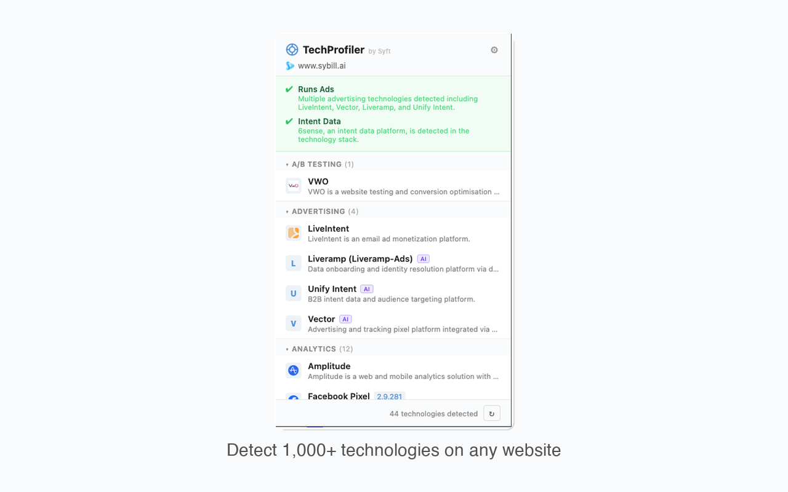
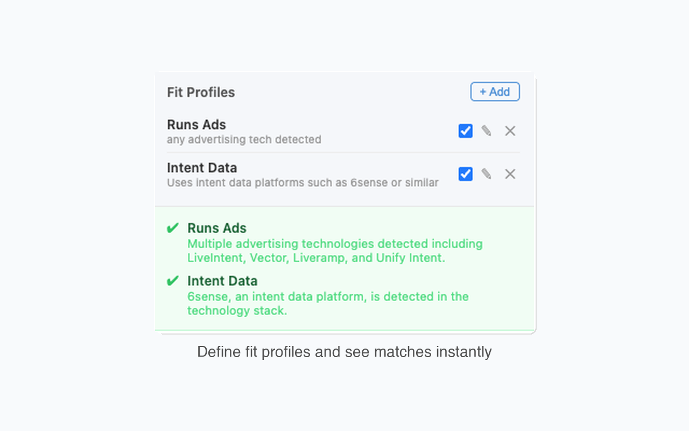
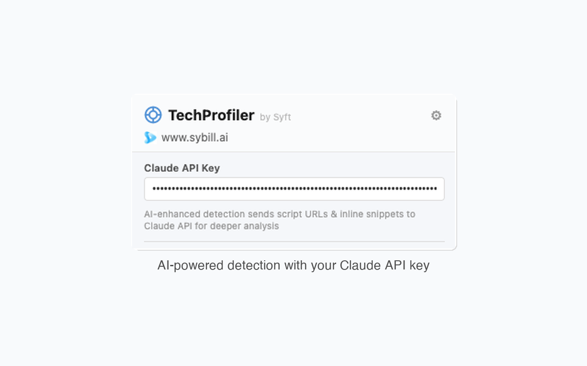

# TechProfiler

A Chrome extension that detects technologies used on any website — frameworks, analytics, advertising, CMS, CDN, and more. Built by [Syft](https://www.syftdata.com).

## Features

- **1,000+ Technology Fingerprints** — Pattern-based detection using script URLs, meta tags, cookies, DOM elements, CSS selectors, and JavaScript globals.
- **AI-Enhanced Detection** — Optionally use a Claude API key to identify additional technologies from script URLs, inline snippets, tracking pixels, iframes, and more.
- **Fit Profiles** — Define custom matching profiles (e.g. "Uses HubSpot", "Runs Ads") and instantly see which profiles match the current site's tech stack. Great for prospecting.
- **Categorized Results** — Technologies are grouped by category (Analytics, Advertising, CDN, CMS, JavaScript framework, etc.) with version detection and confidence scores.
- **One-Click Re-scan** — Re-scan any page to get fresh results.

## Screenshots

### Tech Stack Detection
Detect technologies across categories like analytics, advertising, CDN, CMS, and more.



### Fit Profiles
Define fit profiles and see matches instantly — useful for sales prospecting and competitive analysis.



### AI-Powered Detection
Add your Claude API key to enable deeper analysis of page signals for technologies that pattern matching alone can't catch.



## Installation

### From Source
1. Clone this repository
2. Open `chrome://extensions/` in Chrome
3. Enable **Developer mode** (top right)
4. Click **Load unpacked** and select this directory

### From Chrome Web Store
*(Coming soon)*

## How It Works

1. **Content Script** (`content.js`) — Runs on each page to collect signals: meta tags, script sources, inline scripts, cookies, link hints, iframes, tracking pixels, and stylesheet URLs.
2. **Detector** (`detector.js`) — Pattern matching engine that compares collected signals against a fingerprint database of 1,000+ technologies.
3. **Background Service Worker** (`background.js`) — Orchestrates detection, queries DOM/CSS selectors and JS globals via scripting API, and optionally calls Claude API for AI-enhanced detection and fit profile evaluation.
4. **Popup** (`popup.js` / `popup.html`) — Displays detected technologies grouped by category, fit profile results, and settings.

## Configuration

Click the gear icon in the popup to access settings:

- **Claude API Key** — Enables AI-enhanced detection and fit profile matching. Your key is stored locally and only used to call the Anthropic API.
- **Fit Profiles** — Create profiles with a name and matching prompt. The extension evaluates detected technologies against each profile using Claude and shows match/no-match results with reasoning.

## Project Structure

```
├── manifest.json          # Chrome extension manifest (MV3)
├── background.js          # Service worker: orchestration & API calls
├── content.js             # Content script: signal collection
├── detector.js            # Pattern matching engine
├── popup.html/js/css      # Extension popup UI
├── data/
│   ├── fingerprints_data.json  # Technology fingerprint database
│   └── categories.json         # Category ID → name mapping
├── icons/                 # Extension icons (16/32/48/128px)
└── store-assets/          # Chrome Web Store promotional assets
```

## Privacy

- No data is collected or sent to any server by default.
- If you provide a Claude API key, script URLs and inline snippets from the current page are sent to the Anthropic API for analysis. No other data is transmitted.
- All detection results are stored locally in your browser.

## License

Copyright (c) Syft Data, Inc. All rights reserved.
